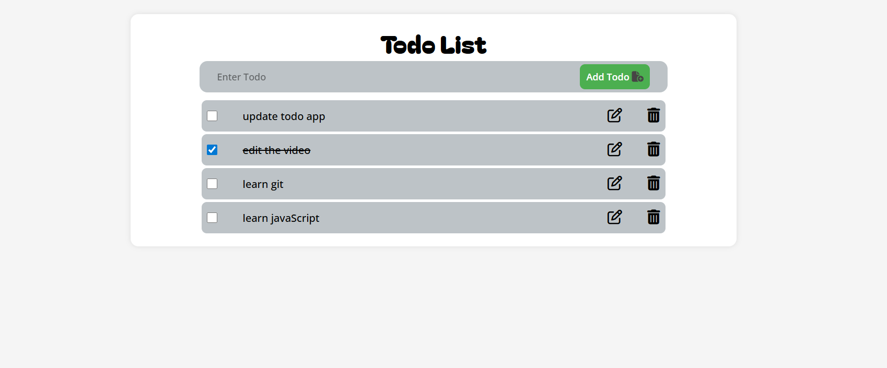

# 📝 Todo App
A clean, minimal, and responsive Todo application built with **HTML**, **CSS**, and **JavaScript**, featuring LocalStorage support for saving tasks permanently.

---

## 🔗 Live Demo
👉 LIve Link:  [https://your-username.github.io/todo-app/](https://biswazit2006.github.io/Todo-List-App-HTML-CSS-JavaScript-/)

---

## 📸 Preview



---

## 📖 About the Project
This is a simple and beginner-friendly Todo App that lets users:

- Add new tasks  
- Delete tasks  
- Mark tasks as complete  
- Automatically save tasks using **localStorage**  
- Load saved tasks even after refreshing the page  

Perfect for learning DOM manipulation and local data storage.

---

## 🚀 Features

- ✔️ Add tasks  
- ✔️ Delete tasks  
- ✔️ Mark tasks as completed  
- ✔️ LocalStorage support  
- ✔️ Clean and responsive UI  

---

## 🛠️ Tech Stack

- **HTML**  
- **CSS**  
- **JavaScript (Vanilla)**  

---

## 📦 How to Run Locally

```bash
git clone https://github.com/your-username/todo-app.git
cd todo-app

---
